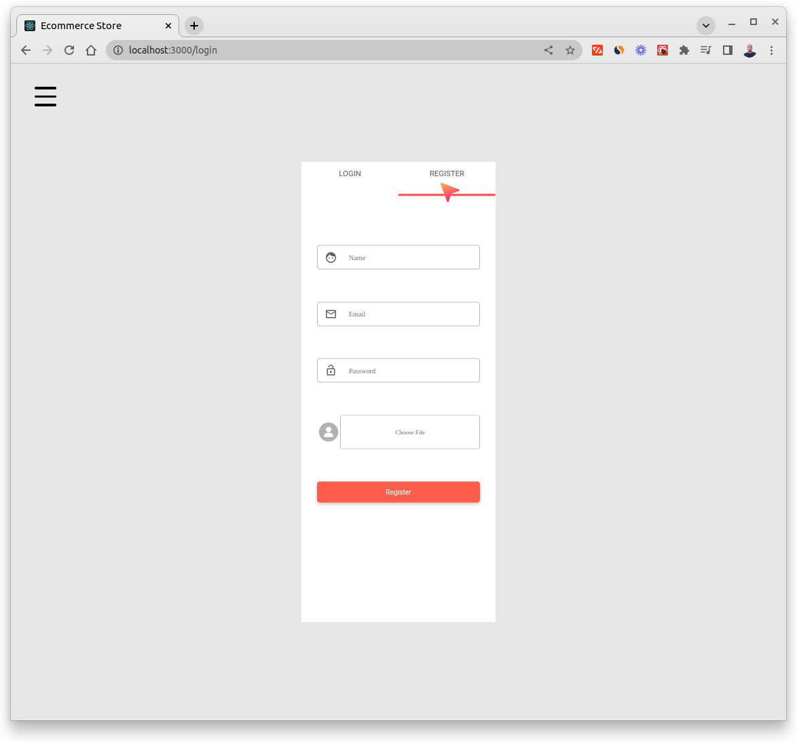
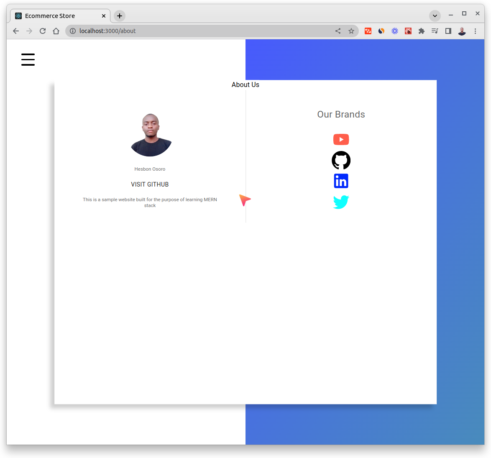

# Ecommerce Store

Site Overview








## Technologies

- React
- Node
- Express
- MongoDB
- Stripe
- Redux
- JWT
- Material-UI
- React Router DOM
- Charts
- Pagination
- Material-UI-Carousel

and More :)

```code
# Clone the repo
git clone https://github.com/hesbon-osoro/ecommerce-store.git

# Navigate to directory and install packages
cd ecommerce-store && yarn

# Start the app
yarn start
```

[`Server`](https://github.com/hesbon-osoro/ecommerce-store-server) code
